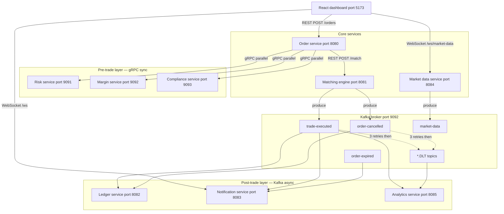
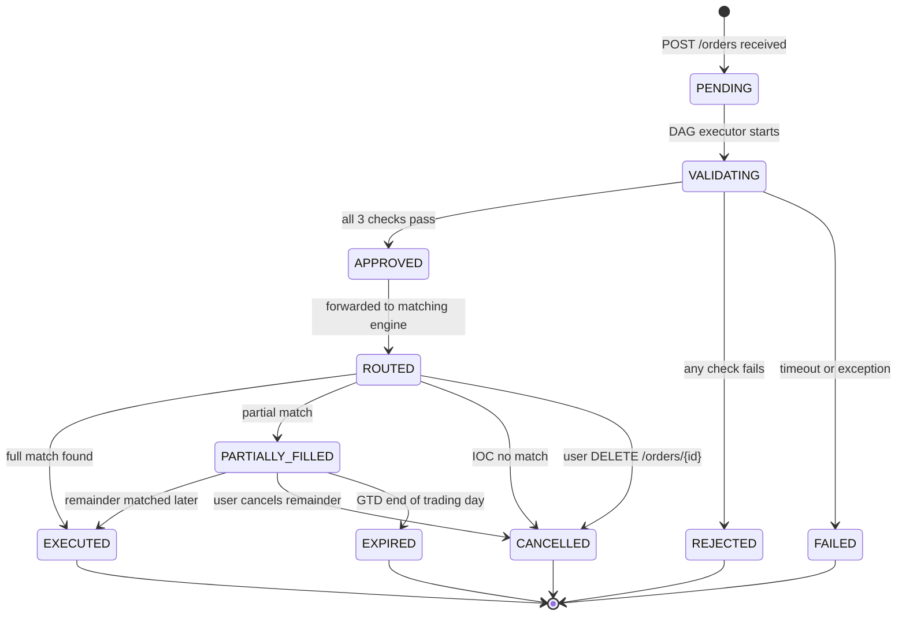
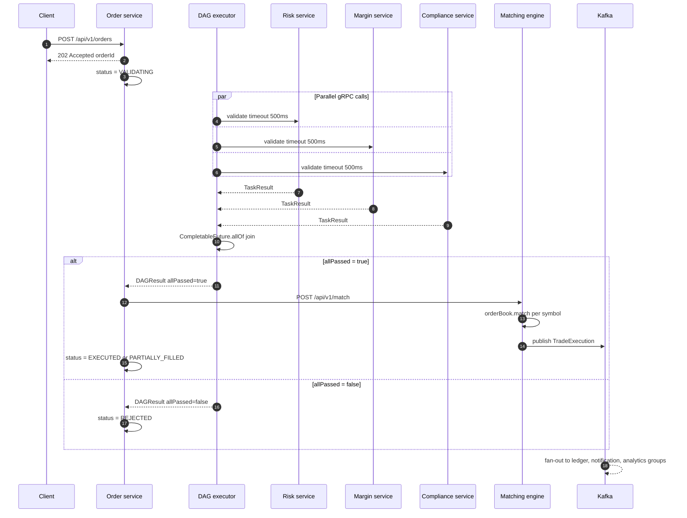

# Trade Execution & Matching Engine

A low-latency, DAG-based trade order orchestration engine that demonstrates
correctness under concurrency — the core problem every real trading system solves.

> **This is not a trading app.**
> It is a control system that ensures safe, parallel execution of dependent
> financial validations before routing orders to a simulated exchange.

---

## Table of contents

- [What this demonstrates](#what-this-demonstrates)
- [Architecture overview](#architecture-overview)
- [System design](#system-design)
- [Services](#services)
- [Pre-trade validation — real business logic](#pre-trade-validation--real-business-logic)
- [Matching engine](#matching-engine)
- [Post-trade processing](#post-trade-processing)
- [Market data](#market-data)
- [Observability](#observability)
- [Tech stack](#tech-stack)
- [Project structure](#project-structure)
- [How to run](#how-to-run)
- [API reference](#api-reference)
- [Running tests](#running-tests)
- [Design decisions](#design-decisions)
- [Known simplifications](#known-simplifications)

---

## What this demonstrates

| Concept | Implementation |
|---|---|
| DAG-based orchestration | `DAGExecutor` fires 3 gRPC calls in parallel via `CompletableFuture.allOf()` |
| Parallel execution under constraints | Independent tasks run concurrently, fan-in at a deterministic aggregation point |
| Failure handling and retry | Per-task retry with exponential backoff, 500ms timeout per call |
| Circuit breakers | Resilience4j on all 3 gRPC channels — CLOSED / OPEN / HALF_OPEN |
| Idempotency | `processedTradeIds` Set prevents double-processing of Kafka events |
| Order state machine | 10 states from PENDING to EXECUTED/CANCELLED/EXPIRED with valid transitions only |
| Real fintech domain logic | Position limits, margin reservation, price circuit breakers, IST market hours |
| Async event-driven architecture | Kafka fan-out to 3 independent consumers post-trade |
| Dead letter queues | 3-retry backoff then DLT routing with full header preservation |
| Price discovery | LTP and VWAP update in real time from actual trade executions |
| Per-symbol order book | Isolated `SymbolOrderBook` per symbol via `OrderBookRegistry` |
| Partial fills | Loop-based matching consumes multiple price levels, re-queues remainder |

---

## Architecture overview

```
┌─────────────────────────────────────────────────────────────┐
│                    React dashboard :5173                      │
│         REST │ WebSocket (notifications, market data)        │
└──────────────────────┬──────────────────────────────────────┘
                       │ REST
                       ▼
              ┌─────────────────┐
              │  Order service  │  :8080  — OMS + DAG executor
              └────────┬────────┘
                       │ gRPC (parallel, sync)
         ┌─────────────┼─────────────┐
         ▼             ▼             ▼
   ┌──────────┐  ┌──────────┐  ┌──────────────┐
   │  Risk    │  │  Margin  │  │  Compliance  │
   │ :9091    │  │ :9092    │  │  :9093       │
   └──────────┘  └──────────┘  └──────────────┘
         │ all pass → fan-in
         ▼
   ┌─────────────────────┐
   │   Matching engine   │  :8081  — per-symbol order books
   └──────────┬──────────┘
              │ Kafka produce
              ▼
   ┌──────────────────────────────┐
   │  Kafka broker  :9092         │
   │  trade-executed              │
   │  order-cancelled             │
   │  order-expired               │
   │  market-data                 │
   │  *.DLT (dead letter topics)  │
   └───────┬──────────────────────┘
           │ fan-out (independent consumer groups)
    ┌──────┼──────────┐
    ▼      ▼          ▼
┌────────┐ ┌────────┐ ┌──────────┐
│Ledger  │ │Notif   │ │Analytics │
│:8082   │ │:8083   │ │:8085     │
└────────┘ └────────┘ └──────────┘

Market data service :8084 — price simulator + LTP/VWAP from trades
Prometheus :9090 — scrapes all services every 5s
Grafana    :3000 — pre-provisioned dashboard
```

---

## System design

### High level design (HLD)



### Order state machine



### DAG execution sequence



---

## Services

| Service | Port | Protocol | Responsibility |
|---|---|---|---|
| order-service | 8080 | REST + gRPC client | OMS, DAG executor, state machine |
| risk-service | 9091 (gRPC) 8090 (HTTP) | gRPC server | Position limits, daily loss, order value |
| margin-service | 9092 (gRPC) 8092 (HTTP) | gRPC server | Margin calculation and reservation |
| compliance-service | 9093 (gRPC) 8093 (HTTP) | gRPC server | Market hours, price bands, duplicates |
| matching-engine | 8081 | REST | Per-symbol order books, partial fills |
| ledger-service | 8082 | Kafka consumer | Balance, holdings, settlement |
| notification-service | 8083 | Kafka consumer + WebSocket | User trade notifications |
| analytics-service | 8085 | Kafka consumer | Per-symbol stats, DLQ monitor |
| market-data-service | 8084 | Kafka producer + WebSocket | LTP, VWAP, price simulation |
| Prometheus | 9090 | — | Metrics scraping |
| Grafana | 3000 | — | Pre-provisioned dashboards |

---

## Pre-trade validation — real business logic

All three services run in parallel via gRPC. The order is approved only if all three pass.
Total pre-trade latency budget: 500ms (with 2 retries per service on failure).

### Risk service

Enforces four rules in order:

1. **Max order value** — single order cannot exceed ₹5,00,000
2. **Daily loss limit** — if user has already lost ₹25,000 today, no more orders
3. **Position limit (BUY)** — projected position cannot exceed 10,000 shares per symbol
4. **Short sell check (SELL)** — cannot sell more shares than currently held

Positions update in real time via a Kafka consumer on `trade-executed`.

### Margin service

Calculates required margin by order type:

- `LIMIT` / `GTD` → delivery margin = 100% of order value
- `IOC` → intraday margin = 20% of order value

Checks `required margin <= available margin` where:

```
available margin = cash balance + holdings value - already reserved margin
```

Reserves margin on approval. Releases on execution or cancellation.
Prevents double-spend: the same funds cannot be reserved for two orders simultaneously.

### Compliance service

Enforces four rules in order:

1. **Market hours** — orders only accepted 09:15–15:30 IST on weekdays
   *(configurable bypass for development: `compliance.bypass-market-hours=true`)*
2. **Banned symbols** — SEBI-suspended or F&O ban period symbols are rejected
3. **Price band** — order price must be within ±20% of previous close
   *(upper circuit and lower circuit enforcement)*
4. **Duplicate detection** — same user, symbol, side, price within 1 second is rejected

---

## Matching engine

### Per-symbol order books

Each symbol (`INFY`, `TCS`, `RELIANCE`, `HDFC`) has its own isolated `SymbolOrderBook`
instance managed by `OrderBookRegistry`. Orders for different symbols never interact.

### Data structure

```java
// Buy side — highest bid first
ConcurrentSkipListMap<Double, ConcurrentLinkedQueue<Order>> buyOrders
    = new ConcurrentSkipListMap<>(Comparator.reverseOrder());

// Sell side — lowest ask first
ConcurrentSkipListMap<Double, ConcurrentLinkedQueue<Order>> sellOrders
    = new ConcurrentSkipListMap<>();
```

- **Price-time priority** — within the same price level, orders are filled FIFO
- **O(log n)** for best bid/ask lookup via `firstKey()`
- **Thread-safe reads** without global locking (lock-free skip list)
- **`synchronized` on `match()`** — the multi-step match operation is atomic

### Matching rule

```
BUY order matches  if: bestAsk <= buyOrder.price
SELL order matches if: bestBid >= sellOrder.price
Execution price    =  resting order's price (not incoming)
```

### Partial fill handling

The match loop runs until `remainingQty <= EPSILON (1e-9)` or no more matching levels exist.
One incoming order can generate multiple `TradeExecution` events — one per price level consumed.
Remainder is re-queued (LIMIT/GTD) or cancelled (IOC).

### Order types

| Type | Behaviour on unmatched remainder |
|---|---|
| LIMIT | Rests in order book indefinitely |
| IOC (Immediate or Cancel) | Remainder cancelled instantly, never enters book |
| GTD (Good Till Day) | Rests in book until 15:30 IST, then expired by scheduler |

---

## Post-trade processing

Three independent Kafka consumer groups all receive every `TradeExecution` event.
A failure in one consumer does not affect the others.

### Ledger service

- Settles cash and holdings for both buyer and seller atomically
- Buyer: cash decreases, symbol holdings increase
- Seller: symbol holdings decrease, cash increases
- Idempotent: `processedTradeIds` Set skips already-processed events
- Exposes: `GET /api/v1/ledger/{userId}`, `/holdings`, `/history`

### Notification service

- Builds human-readable message per trade and cancellation
- Pushes via Spring WebSocket to `/topic/notifications/{userId}`
- Exposes: `GET /api/v1/notifications/{userId}`

### Analytics service

- Maintains per-symbol stats: `totalTrades`, `totalVolume`, `lastPrice`, `avgPrice`
- Monitors DLQ topics and exposes error counts
- Exposes: `GET /api/v1/analytics/symbols`, `/symbols/{symbol}`, `/dlq`

### Dead letter queue

All three consumers use `DefaultErrorHandler` with exponential backoff:

```
Attempt 1 → fail → wait 1s
Attempt 2 → fail → wait 3s
Attempt 3 → fail → wait 10s
After 3 failures → route to {topic}.DLT with error headers preserved
```

---

## Market data

Price updates from two sources:

1. **Real trades** — every `TradeExecution` triggers an LTP (last traded price) update
   and recalculates VWAP (volume weighted average price) for that symbol.
   Pushed immediately via WebSocket.

2. **Simulator** — when no recent trade exists, a scheduled tick generates price movement
   with volume-dampened volatility:
   - High recent volume → lower volatility (price well-discovered)
   - Low recent volume → higher volatility (illiquid, uncertain price)
   - Clamped to ±5% from starting price

Supported symbols and starting prices:

| Symbol | Starting price |
|---|---|
| INFY | ₹1,820 |
| TCS | ₹3,480 |
| RELIANCE | ₹2,910 |
| HDFC | ₹1,640 |

---

## Observability

### Metrics (Prometheus + Grafana)

Custom metrics exposed at `/actuator/prometheus` on every service:

| Metric | Type | Description |
|---|---|---|
| `orders.placed` | Counter | Tags: symbol, side |
| `orders.rejected` | Counter | Tag: reason |
| `dag.execution.time` | Timer | End-to-end DAG latency |
| `orderbook.depth` | Gauge | Total resting orders across all books |
| `dlq.messages` | Counter | Tag: topic |

Grafana dashboard auto-provisions on startup at `http://localhost:3000` (admin / admin).
Panels: order pipeline stats, DAG p50/p95/p99 latency, circuit breaker states,
Kafka consumer lag, DLQ count, JVM heap, CPU per service, order book depth.

### Distributed tracing via correlation ID

Every HTTP request gets a correlation ID (from `X-Correlation-ID` header or generated).
Placed in MDC — every log line across every service includes it:

```
10:42:31 [a3f1-9b2c] INFO  DAGExecutor - All checks passed for ORD-001
10:42:31 [a3f1-9b2c] INFO  OrderService - Status APPROVED → ROUTED for ORD-001
```

Grep one correlation ID to trace a single order's full journey across 9 services.

### Circuit breakers

Resilience4j circuit breakers on all 3 gRPC channels:

```
CLOSED    → normal operation
OPEN      → 50%+ failure rate — fail fast, no network call made
HALF_OPEN → test recovery with limited calls after 10s wait
```

Live circuit breaker states: `GET /api/v1/health/circuit-breakers`

---

## Tech stack

| Layer | Technology |
|---|---|
| Language | Java 17 |
| Framework | Spring Boot 3.x |
| Pre-trade RPC | gRPC (io.grpc) + Protobuf |
| Messaging | Apache Kafka |
| Resilience | Resilience4j (circuit breaker, retry) |
| Real-time push | Spring WebSocket |
| Metrics | Micrometer + Prometheus |
| Dashboards | Grafana |
| Build | Maven multi-module |
| Containers | Docker + Docker Compose |
| Frontend | React 18 + TypeScript + Vite + Tailwind CSS |
| Charts | Recharts |
| Testing | JUnit 5 + Testcontainers + Mockito + Awaitility |

---

## Project structure

```
trade-orchestration-engine/
├── common/                        # Shared models — Order, TaskResult, TradeExecution etc.
├── order-service/                 # OMS, DAG executor, REST API, circuit breakers
├── risk-service/                  # gRPC server — position limits, loss limits
├── margin-service/                # gRPC server — margin calculation and reservation
├── compliance-service/            # gRPC server — market hours, price bands, duplicates
├── matching-engine/               # Per-symbol order books, partial fills, Kafka producer
├── ledger-service/                # Kafka consumer — cash and holdings settlement
├── notification-service/          # Kafka consumer + WebSocket — user notifications
├── analytics-service/             # Kafka consumer — symbol stats, DLQ monitor
├── market-data-service/           # Price simulator, LTP/VWAP, WebSocket feed
├── integration-tests/             # Testcontainers Kafka, gRPC mocks, end-to-end flows
├── dashboard/                     # React 18 + TypeScript + Vite dashboard
├── proto/                         # risk.proto, margin.proto, compliance.proto
├── monitoring/
│   ├── prometheus.yml             # Scrape config for all 9 services
│   └── grafana/
│       └── provisioning/
│           ├── datasources/       # Auto-wired Prometheus datasource
│           └── dashboards/        # trade-engine.json — auto-loaded on startup
├── docker-compose.yml             # Kafka, Zookeeper, all services, Prometheus, Grafana
├── .env.example                   # Required environment variables
└── postman_collection.json        # 11 endpoints with test scripts
```

---

## How to run

### Prerequisites

- Java 17+
- Maven 3.9+
- Docker Desktop (running)
- Node 18+

### Step 1 — Copy environment file

```bash
cp .env.example .env
```

### Step 2 — Start infrastructure

```bash
docker-compose up -d zookeeper kafka
```

Wait 20 seconds for Kafka to be ready, then verify:

```bash
docker-compose ps
# Both zookeeper and kafka should show "Up"
```

### Step 3 — Build all modules

```bash
mvn clean install -DskipTests
```

First build takes ~2 minutes (protobuf generation included).

### Step 4 — Start gRPC services first

```bash
cd risk-service       && mvn spring-boot:run &
cd margin-service     && mvn spring-boot:run &
cd compliance-service && mvn spring-boot:run &
```

Wait until all three log `gRPC server started on port 909x`.

### Step 5 — Start matching engine

```bash
cd matching-engine && mvn spring-boot:run &
```

### Step 6 — Start order service

```bash
cd order-service && mvn spring-boot:run &
```

### Step 7 — Start post-trade consumers

```bash
cd ledger-service       && mvn spring-boot:run &
cd notification-service && mvn spring-boot:run &
cd analytics-service    && mvn spring-boot:run &
```

### Step 8 — Start market data service

```bash
cd market-data-service && mvn spring-boot:run &
```

### Step 9 — Start React dashboard

```bash
cd dashboard
npm install
npm run dev
```

### Step 10 — Start monitoring stack

```bash
docker-compose up -d prometheus grafana
```

### Verify everything is alive

```bash
# Order service health
curl http://localhost:8080/actuator/health

# Market data (should show 4 symbols with live prices)
curl http://localhost:8084/api/v1/market-data

# Place a test order
curl -X POST http://localhost:8080/api/v1/orders \
  -H "Content-Type: application/json" \
  -d '{
    "userId":    "U1",
    "symbol":    "INFY",
    "side":      "BUY",
    "quantity":  10,
    "price":     1850,
    "orderType": "LIMIT"
  }'
```

### Open in browser

| URL | Description |
|---|---|
| http://localhost:5173 | React dashboard |
| http://localhost:3000 | Grafana (admin / admin) |
| http://localhost:9090 | Prometheus raw metrics |

---

## API reference

### Order service — :8080

| Method | Path | Body | Response | Description |
|---|---|---|---|---|
| POST | /api/v1/orders | `PlaceOrderRequest` | 202 `{orderId, status}` | Place a new order |
| GET | /api/v1/orders/{orderId} | — | `Order` | Get order by ID |
| GET | /api/v1/orders/user/{userId} | — | `List<Order>` | All orders for a user |
| DELETE | /api/v1/orders/{orderId} | — | 200 / 409 | Cancel an order |
| GET | /api/v1/health/circuit-breakers | — | CB states | Risk/Margin/Compliance CB state |

**PlaceOrderRequest**
```json
{
  "userId":    "U1",
  "symbol":    "INFY",
  "side":      "BUY",
  "quantity":  10,
  "price":     1850.00,
  "orderType": "LIMIT"
}
```

### Matching engine — :8081

| Method | Path | Body | Response | Description |
|---|---|---|---|---|
| POST | /api/v1/match | `Order` | `MatchResponse` | Route approved order to book |
| DELETE | /api/v1/orders/{orderId} | — | `{cancelled}` | Remove order from book |
| GET | /api/v1/orderbook/{symbol} | — | `BookSnapshot` | Top 5 bids and asks |
| GET | /api/v1/orderbook | — | All snapshots | All symbol order books |

### Ledger service — :8082

| Method | Path | Description |
|---|---|---|
| GET | /api/v1/ledger/{userId} | Cash balance and available margin |
| GET | /api/v1/ledger/{userId}/holdings | Symbol → quantity map |
| GET | /api/v1/ledger/{userId}/history | All ledger entries desc by timestamp |

### Risk service — :8090

| Method | Path | Description |
|---|---|---|
| GET | /api/v1/risk/positions/{userId} | All current positions |
| GET | /api/v1/risk/config | Active risk limits |
| PUT | /api/v1/risk/positions/{userId}/{symbol}?quantity=X | Update position manually |

### Margin service — :8092

| Method | Path | Description |
|---|---|---|
| GET | /api/v1/margin/{userId} | Balance, reserved, available margin |
| PUT | /api/v1/margin/{userId}/deposit?amount=X | Add funds |

### Compliance service — :8093

| Method | Path | Description |
|---|---|---|
| GET | /api/v1/compliance/bands | All symbols with price bands |
| GET | /api/v1/compliance/banned | List of banned symbols |
| POST | /api/v1/compliance/banned/{symbol} | Ban a symbol |
| DELETE | /api/v1/compliance/banned/{symbol} | Unban a symbol |

### Market data service — :8084

| Method | Path | Description |
|---|---|---|
| GET | /api/v1/market-data | Current prices for all symbols |
| GET | /api/v1/market-data/{symbol} | Single symbol price tick |
| GET | /api/v1/market-data/{symbol}/history | Last 100 ticks for sparkline |

### Analytics service — :8085

| Method | Path | Description |
|---|---|---|
| GET | /api/v1/analytics/symbols | Stats for all symbols |
| GET | /api/v1/analytics/symbols/{symbol} | Stats for one symbol |
| GET | /api/v1/analytics/dlq | DLQ message counts per topic |

### Notification service — :8083

| Method | Path | Description |
|---|---|---|
| GET | /api/v1/notifications/{userId} | All notifications for a user |

---

## Running tests

### Unit tests (no infrastructure needed)

```bash
# DAGExecutor — parallel execution, retry, timeout, circuit breaker
# OrderBook — matching, partial fills, IOC, cancellation, concurrency
# Risk/Margin/Compliance — real business rule validation
mvn test -pl order-service,matching-engine,risk-service,margin-service,compliance-service
```

### Integration tests (Testcontainers — spins up its own Kafka)

```bash
mvn test -pl integration-tests
```

Scenarios covered:
1. Happy path — order fully matched end to end
2. Order rejected when any validation fails
3. IOC partial match — remainder cancelled
4. Circuit breaker trips after repeated failures
5. DLQ receives event after 3 consumer failures

---

## Design decisions

**Why gRPC for pre-trade, Kafka for post-trade?**

Pre-trade validation is synchronous — the OMS must wait for all three results before routing. gRPC over HTTP/2 provides the lowest latency for this blocking call. Post-trade processing (ledger, notifications, analytics) does not block trade confirmation. Kafka decouples producers and consumers, enables replay on failure, and isolates consumer group failures from each other.

**Why `ConcurrentSkipListMap` for the order book?**

Sorted by price (O(log n) for best bid/ask) and lock-free for concurrent reads. `TreeMap` is sorted but requires external synchronization — a global lock under concurrent order flow. `HashMap` is fast but unsorted — finding the best price requires a full O(n) scan.

**Why `CompletableFuture.allOf()` and not sequential calls?**

Three sequential gRPC calls at 150ms each = 450ms total. Three parallel calls = 150ms total (the slowest one). The pre-trade budget is 500ms. Sequential execution would frequently breach it.

**Why 202 Accepted and not 200 OK for order placement?**

202 is the correct HTTP semantic — the request is received and accepted for processing, but processing has not completed. The client must poll for the final status. This is exactly how real brokers behave.

**Why no Eureka or API Gateway?**

All services run on known fixed addresses. Service discovery adds operational complexity with no benefit at this scale. In a production system with horizontal scaling, Eureka or Consul would be introduced. The architecture is designed so these can be added without changing the core DAG logic.

---

## Known simplifications

These are intentional trade-offs for a demo system. Each has a production alternative.

| Simplification | Production alternative |
|---|---|
| In-memory order book (ConcurrentSkipListMap) | Redis sorted sets — persistent across restarts |
| In-memory positions and balances (ConcurrentHashMap) | PostgreSQL for audit trail, Redis for real-time checks |
| O(n) order cancel scan | Maintain a parallel `HashMap<orderId, Order>` for O(1) cancel lookup |
| Single-node Kafka | Multi-broker Kafka cluster with replication factor 3 |
| Simulated gRPC service logic | Real risk engine connected to live portfolio database |
| Poll-based order status in dashboard | WebSocket or SSE push from order service on every state transition |
| Fixed symbol list | Dynamic symbol registry with exchange feed integration |

---

## Supported test users

Pre-seeded in all three validation services:

| User | Cash balance | INFY position | Daily PnL |
|---|---|---|---|
| U1 | ₹1,00,000 | 8,000 shares | -₹8,000 |
| U2 | ₹2,50,000 | 0 shares | +₹5,000 |
| U3 | ₹50,000 | 0 shares | ₹0 |

Use these userIds to test different validation scenarios:
- U1 trying to BUY 3,000 INFY → rejected by risk (position limit: max 10,000, current 8,000 + 3,000 = 11,000)
- U3 trying to BUY ₹60,000 of stock → rejected by margin (balance ₹50,000)
- Any user ordering YESBANK → rejected by compliance (banned symbol)
- Any user ordering outside 09:15–15:30 IST → rejected by compliance (market hours)
